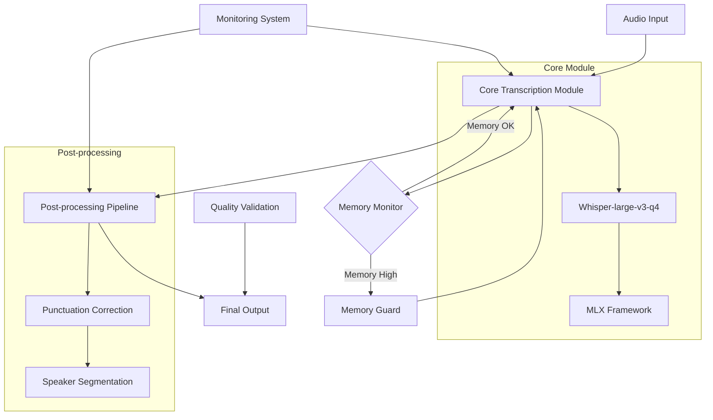
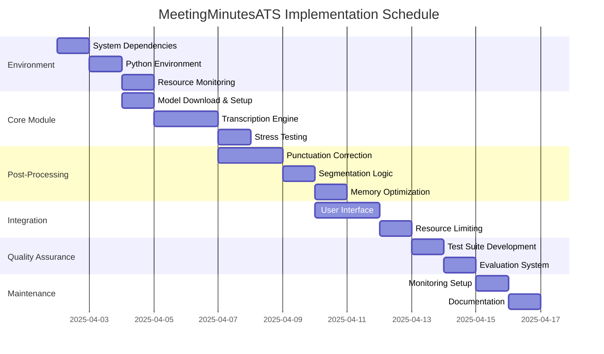

# Meeting Minutes Automatic Transcription System (MeetingMinutesATS) Implementation Plan

## Project Overview

The MeetingMinutesATS is a transcription system designed to run on M3 Pro (18GB) hardware with the following key requirements:
- Memory usage ≤ 14GB (reserving 4GB for system)
- Paragraph-level accuracy ≥ 95%
- Processing speed of 1.5x real-time (60 min audio processed in ≤ 40 min)

The system leverages the whisper-large-v3-q4 model via MLX framework optimized for Apple Silicon.

## Implementation Phases

### Phase 1: Environment Setup (Estimated time: 1 day)
1. Install system dependencies:
   - Pyenv and pyenv-virtualenv for Python environment management
   - FFmpeg for audio processing
2. Set up Python 3.10.13 environment with MLX framework
3. Configure Metal acceleration and memory limits
4. Implement resource monitoring script

### Phase 2: Core Transcription Module (Estimated time: 2-3 days)
1. Download and validate the quantized whisper-large-v3-q4 model
2. Implement the transcription engine with specified parameters:
   - Beam size: 5
   - Temperature: 0.2
   - Language: zh-tw
   - Custom prompts for mixed language (Chinese 70%, English 30%)
3. Develop chunked processing to handle memory constraints
4. Conduct stress testing with sample audio files

### Phase 3: Post-processing Pipeline (Estimated time: 2-3 days)
1. Implement punctuation correction module:
   - Handle mixed Chinese/English punctuation
   - Fix date formats
   - Correct sentence endings
2. Develop speaker segmentation logic:
   - Implement maximum character limits
   - Handle split sentences across segments
3. Optimize memory usage through chunked processing and incremental output

### Phase 4: Integration and Automation (Estimated time: 2 days)
1. Implement either:
   - Raycast integration for user-friendly activation
   - Folder Action monitoring for automatic processing of new recordings
2. Add resource limiting mechanisms:
   - Semaphore system to control concurrent processing
   - Memory guards to prevent system overload

### Phase 5: Quality Validation System (Estimated time: 2 days)
1. Develop test case suite:
   - Pure Chinese content
   - Mixed Chinese-English content
   - Audio with background noise
2. Create evaluation functions:
   - Character Error Rate (CER) calculation
   - Word Error Rate (WER) calculation
   - Key phrase recognition rate

### Phase 6: Maintenance and Monitoring (Ongoing)
1. Implement memory reclamation mechanisms
2. Set up log analysis and alerting system
3. Create fallback procedures for handling out-of-memory situations
4. Establish risk mitigation strategies for long audio and language detection issues

## Architecture Diagram

## Development Tasks and Priorities

## Implementation Details and Resource Requirements

For each task, we'll need to track:
1. Memory usage patterns
2. Processing speed
3. Transcription accuracy
